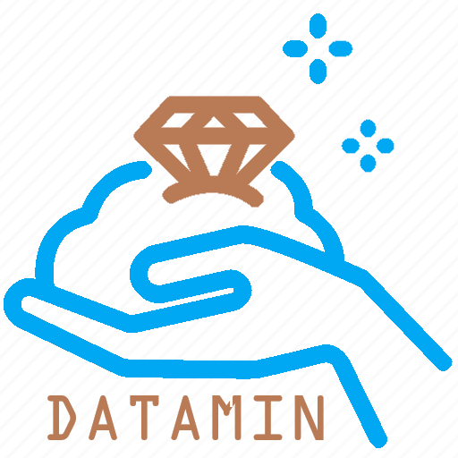

# Unit testing & Airflow orchestration (in Linux distro)
I have created this repository to use a couple of tools of data engineering in a single project. Data Engineering involves making data processing a reliable, repeatable, and maintainable process. I will primarily use unit testing (to ensure data quality), Docker (to conteinerize our Linux env) and Airflow (for data orchestration).

Unit testing is a bag of techniques used to assure data quality. Once data is being pipelined from one point to another, premises may change - trailing zeros, lower/uppercasing, data type changes, etc. Bug fixes, new features and refactoring are other factors. To assure that everything that is feed into a data environment is kept integer, automation should raise any of these inconsistencies as soon as they are identifiable. This is where unit testing comes in.

Airflow is a platform to program workflows, including the creation, scheduling, and monitoring of said workflows. These workflows are represented through DAGs (direct acyclic graphs) which are basically graphs which are monodirectional ("direct") and do not involve loops ("acyclic").

# Why do unit testing?
Time savings and reduced downtime are the major benefits of unit testing, while improved documentation and more user trust are great side effects. Unit testing is thus a great ally to a data scientist, data engineer or a ML engineer to ensure data quality.

# Storytelling: DATAMIN, our mining company
To showcase some unit testing cases, we will create our own company, DATAMIN. DATAMIN works as a consulting company for mineral processing companies.

We will use the open database for coal and metal mine production (https://zenodo.org/record/7369478) presented on a Nature paper (https://www.nature.com/articles/s41597-023-01965-y). We will only use the file containing mineral processing information (processing.csv) which contains mines, their locations, type of processing plant, production output and other relevant data.

On a later stage, we will use a tweaked, broken version of it (we will call it "broken_processing.csv"). Fields that are supposed to contain commas, sometimes don't; fields that are integers, sometimes come as strings; and so on. Then we will proceed to execute the tests and check if the tests written are capturing these errors.

